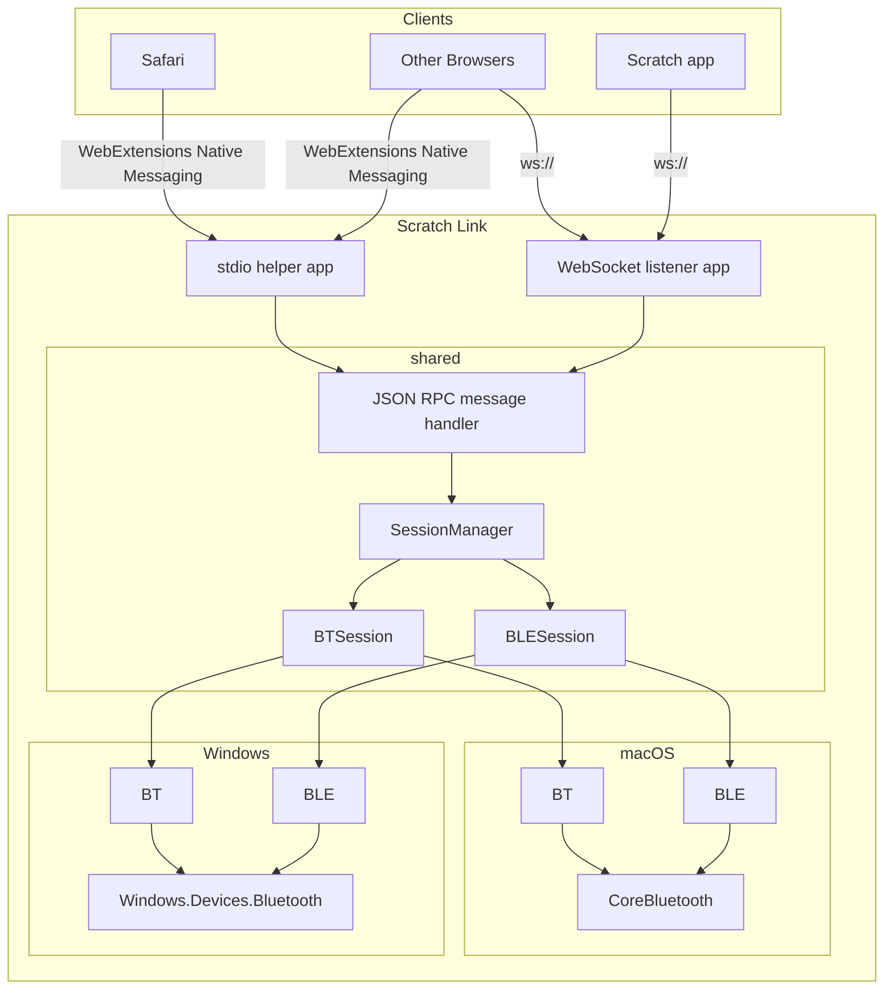

# Scratch Link 2.x Architecture

## Requirements

* Communicate with Scratch running at <https://scratch.mit.edu/> in any supported browser on macOS or Windows:
  * Chrome 63+
  * Firefox 57+
  * Safari 11+
  * Edge 15+
* Communicate with the Scratch 3 app running on macOS or Windows
  * Must not require an active Internet connection
* Avoid the need for an SSL certificate
* Support all peripherals which were supported by Scratch Link 1.x
  * Bluetooth LE
  * Bluetooth Classic

## Nice-to-have

* Leave the door open for Linux support
* Other forms of peripheral
  * HID
  * Non-Bluetooth serial

## Implications

Unlike Chrome and Firefox, Safari (and WebKit in general) does not currently exempt `127.0.0.1` or `localhost` from
secure context requirements. That is, a web page loaded over HTTPS will not be able to access even local services
over HTTP or WS in Safari: only HTTPS or WSS will work.

Providing service over HTTPS or WSS would require an SSL certificate, though, which violates another requirement.

So, to satisfy all of the requirements including access from Safari, we must provide a method of communication which
does not use HTTP(S) or WS(S).

## Architecture

We can satisfy Safari by using the "Native Messaging" features of the
[WebExtensions API](https://developer.mozilla.org/en-US/docs/Mozilla/Add-ons/WebExtensions), embedded in a
[Safari-specific
wrapper](https://developer.apple.com/documentation/safariservices/safari_web_extensions/converting_a_web_extension_for_safari).
MDN provides some documentation on [building a cross-browser
extension](https://developer.mozilla.org/en-US/docs/Mozilla/Add-ons/WebExtensions/Build_a_cross_browser_extension).

The Scratch app for Mac & Windows can communicate with Scratch Link over a `ws://` connection to avoid the need to
load WebExtension files.

Other browsers may choose to communicate with Scratch Link using either method.

