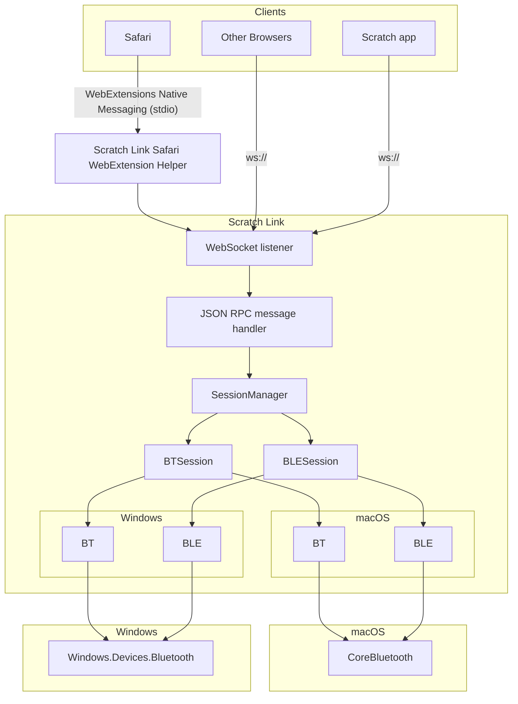
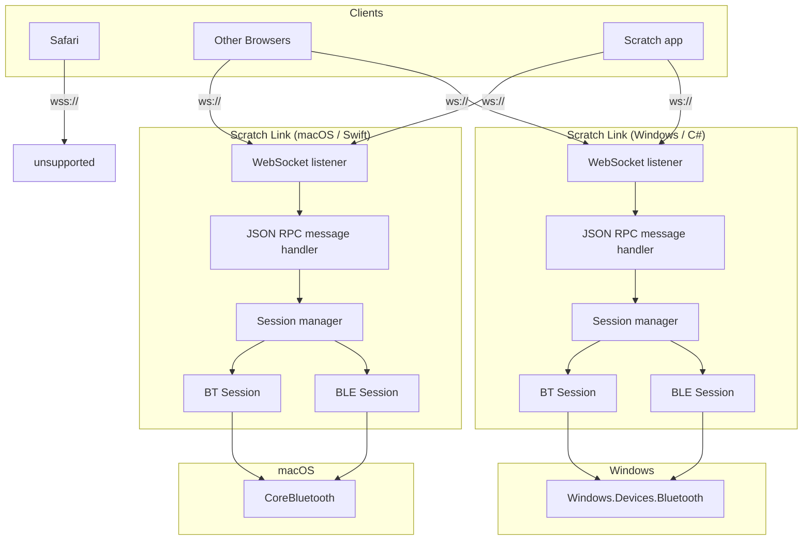

# Scratch Link 2.x Architecture

## Requirements

* Communicate with Scratch running at <https://scratch.mit.edu/> in any supported browser on macOS or Windows:
  * Chrome 63+
  * Firefox 57+
  * Safari 11+
  * Edge 15+
* Communicate with the Scratch 3 app running on macOS or Windows
  * Must not require an active Internet connection
* Avoid the need for an SSL certificate
* Support all peripherals which were supported by Scratch Link 1.x
  * Bluetooth LE
  * Bluetooth Classic

## Nice-to-have

* Leave the door open for Linux support
* Other forms of peripheral
  * HID
  * Non-Bluetooth serial

## Implications

Unlike Chrome and Firefox, Safari (and WebKit in general) does not currently exempt `127.0.0.1` or `localhost` from
secure context requirements. That is, a web page loaded over HTTPS will not be able to access even local services
over HTTP or WS in Safari: only HTTPS or WSS will work.

Providing service over HTTPS or WSS would require an SSL certificate, though, which violates another requirement.

So, to satisfy all of the requirements including access from Safari, we must provide a method of communication which
does not use HTTP(S) or WS(S).

## Architecture

We can satisfy Safari by using the "Native Messaging" features of the
[WebExtensions API](https://developer.mozilla.org/en-US/docs/Mozilla/Add-ons/WebExtensions), embedded in a
[Safari-specific
wrapper](https://developer.apple.com/documentation/safariservices/safari_web_extensions/converting_a_web_extension_for_safari).
MDN provides some documentation on [building a cross-browser
extension](https://developer.mozilla.org/en-US/docs/Mozilla/Add-ons/WebExtensions/Build_a_cross_browser_extension).

Other browsers are capable of either `ws://` or WebExtension communication. However, current versions of MAUI make it
difficult (maybe impossible) to communicate over `stdio` as needed by WebExtension native messaging. Since Safari is
the only browser which strictly needs this, and Safari needs a WebExtension wrapper app anyway, we can implement that
wrapper using Swift or Objective C and use the macOS native WebSocket client. The only downside to the lack of a
WebExtension component for other browsers is that those other browsers will not be able to auto-launch Scratch Link.
If this limitation is lifted in a future version of MAUI, we can add that as a nice-to-have.

The Scratch app for Mac & Windows can communicate with Scratch Link over a `ws://` connection, just like other
browsers. Because we're making a loopback connection over `ws://` we won't need to worry about DNS resolution, which
means we will be able to use Scratch Link in a truly offline environment without needing any DNS workarounds.

## Previous Architecture

For reference, the architecture of Scratch Link 1.4 was as shown below.

Major differences include:

* The Windows and macOS versions of the application are two completely separate implementations of the same
  architecture.
  * The macOS version is implemented in Swift and uses the `CoreBluetooth` API.
  * The Windows version is written in C# and uses the `Windows.Devices.Bluetooth` API.
* Safari is unsupported due to the "secure contexts" requirement discussed in the "Implications" section above.
  * Scratch Link 1.3 used `wss://` instead of `ws://`, so it supported Safari but required an SSL certificate.
