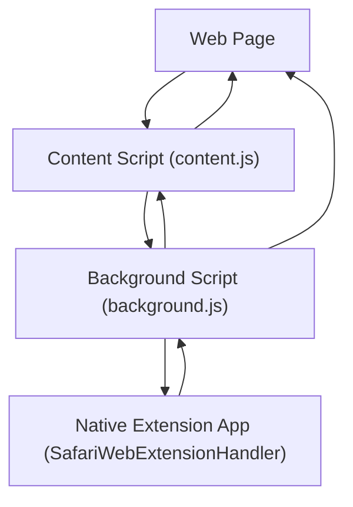

# Safari WebExtension messaging

The Scratch Link Safari Helper uses Safari's version of the WebExtension API. Communication between components is
restricted and each component has its own set of communication channels. The components and communication channels are
documented here to help make sense of the spaghetti.

## Components

The components involved in extension communication include:

* The web page loaded in Safari, for example `https://scratch.mit.edu/projects/editor/`. This is the only component
  that isn't itself part of the extension, but it needs to communicate with components that are.
* The "Content Script" (`content.js`). This is injected into the web page by the extension. For the most part it's
  treated as if it were part of the web page itself, but it has access to the `browser` object which includes a few
  APIs not available to the regular web page. There's a separate instance of this per web page.
* The "Background Script" (`background.js`). This can be seen as the main entry point for the extension. It's the
  only component that can communicate with the extension's native component. There's only one instance of this
  regardless of how many web pages are loaded.
* The native extension application. This is a native application with an object which implements the
  `NSExtensionRequestHandling` Objective-C protocol.

Safari's WebExtension implementation requires that an extension be hosted by a native application -- in this case,
Scratch Link. There are Safari-specific ways to communicate between the WebExtension and its host app, but Scratch
Link does not use those so they're not covered here.

## Communication Methods

From | To | Type | Send | Receive
-----|----|------|------|--------
Page | Page + Content | Notify | `targetWindow.postMessage` | `self.addEventListener('message')`
Content | Page + Content | Notify | `targetWindow.postMessage` | `self.addEventListener('message')`
Content | Background | Request | `browser.runtime.sendMessage` | `browser.runtime.onMessage.addListener`
Content | Background | Port | `browser.runtime.connect` | `browser.runtime.onConnect.addListener`
Background | Content | Notify | `browser.tabs.sendMessage` | `browser.runtime.onMessage.addListener`
Background | Content | Port | `browser.tabs.connect` | `browser.runtime.onConnect.addListener`
Background | Extension | Request | `browser.runtime.sendNativeMessage` | `NSExtensionRequestHandling.beginRequest`
Extension | Background | Notify | `SFSafariApplication.dispatchMessage` | `browser.runtime.connectNative`

Types:

* A notification ("Notify") is a one-time, one-way communication with no built-in response mechanism.
* A "Request" is a one-time communication with a built-in response mechanism, similar to a function call with return value.
* A "Port" is a persistent connection which can direct notifications. A port may or may not be bidirectional.

## Documentation and Notes

* `targetWindow.postMessage`
  * <https://developer.mozilla.org/en-US/docs/Mozilla/Add-ons/WebExtensions/Content_scripts#communicating_with_the_web_page>
  * <https://developer.mozilla.org/en-US/docs/Web/API/Window/postMessage>
* `browser.runtime.sendMessage` and `browser.tabs.sendMessage`
  * <https://developer.mozilla.org/en-US/docs/Mozilla/Add-ons/WebExtensions/Content_scripts#one-off_messages>
  * Call `sendResponse` _before the listener returns_ to set the value given to the sender's `Promise`.
* `browser.runtime.connect` and `browser.tabs.connect`
  * <https://developer.mozilla.org/en-US/docs/Mozilla/Add-ons/WebExtensions/Content_scripts#connection-based_messaging>
* `browser.runtime.sendNativeMessage` and `NSExtensionRequestHandling.beginRequest`
  * <https://developer.apple.com/documentation/safariservices/safari_web_extensions/messaging_between_the_app_and_javascript_in_a_safari_web_extension#3600044>
  * The `context.completeRequest` call does not need to be called synchronously / before `beginRequest` returns.
    Calling it later works fine.
  * The `sendNativeMessage` callback will not be called until `context.completeRequest` is called by the extension app.
* `SFSafariApplication.dispatchMessage` and `browser.runtime.connectNative`
  * <https://developer.apple.com/documentation/safariservices/safari_web_extensions/messaging_between_the_app_and_javascript_in_a_safari_web_extension#3600049>
  * The port opened by `connectNative` seems to be unidirectional (receive only).
